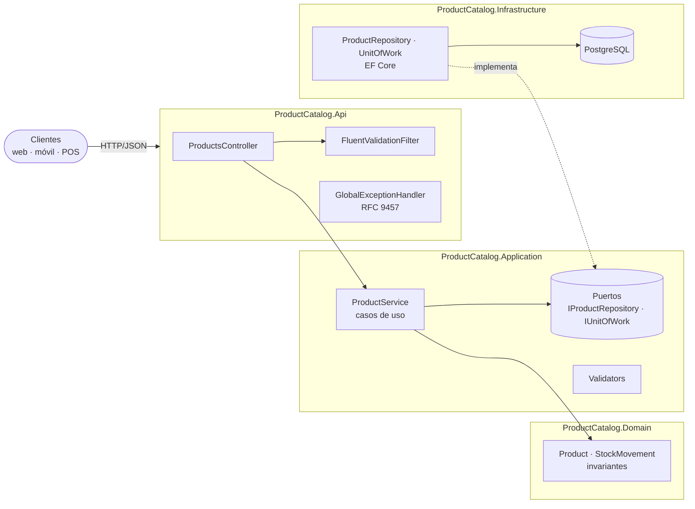

# Product Catalog API

[](https://github.com/Ms0910/ptb-product-catalog-api/actions/workflows/ci.yml)

API REST en **.NET 10** para gestionar un catálogo de productos y su stock. Está pensada como núcleo transaccional para varias plataformas concurrentes: el stock **nunca** queda negativo ni pierde actualizaciones, cada cambio queda auditado y los reintentos son seguros gracias a la idempotencia.

| | |
|---|---|
| **Demo (Swagger UI)** | [https://ptb-product-catalog-api.onrender.com/swagger](https://ptb-product-catalog-api.onrender.com/swagger) |
| **OpenAPI** | `/openapi/v1.json` |
| **Health** | `/health/live` · `/health/ready` |

> En el plan gratuito de Render el servicio se suspende tras 15 minutos sin tráfico. La primera petición puede tardar unos 30–60 s mientras arranca.

---

## Contenido

1. [Qué incluye](#qué-incluye)
2. [Stack](#stack)
3. [Arquitectura](#arquitectura)
4. [Endpoints](#endpoints)
5. [Concurrencia y consistencia del stock](#concurrencia-y-consistencia-del-stock)
6. [Errores](#errores)
7. [Ejecutar en local](#ejecutar-en-local)
8. [Tests](#tests)
9. [Despliegue](#despliegue)
10. [Configuración](#configuración)
11. [Decisiones técnicas](#decisiones-técnicas)
12. [Próximos pasos](#próximos-pasos)

---

## Qué incluye

| Requisito | Implementación |
|---|---|
| Crear producto (nombre, descripción, precio, stock inicial) | `POST /api/products` → `201 Created` + `Location` + `ETag` |
| Consultar por id | `GET /api/products/{id}` → `200` / `404` |
| Actualizar stock (sumar/restar, nunca negativo) | `PATCH /api/products/{id}/stock` con `Increase`/`Decrease` → `200` / `409` si no alcanza |
| CRUD con respuestas semánticas y paginación | `GET` paginado con búsqueda y orden, `PUT` (`200`/`412`), `DELETE` (`204`) |
| Validaciones y reglas de negocio | FluentValidation (400 con todos los errores), invariantes en el dominio y `CHECK` en la BD |
| Swagger funcional y legible | OpenAPI nativo de .NET 10, documentado con comentarios XML y ejemplos, y Swagger UI |
| Arquitectura | Clean Architecture (Domain / Application / Infrastructure / Api) verificada con tests de arquitectura |
| Replicable y desplegable | `docker compose up`, Dockerfile multi-stage, blueprint de Render, CI en GitHub Actions |

**Extras:**
- **Concurrencia segura:** bloqueo de fila al ajustar stock, probado con 50 solicitudes simultáneas.
- **Idempotencia:** header `Idempotency-Key` en el ajuste de stock.
- **Concurrencia optimista:** `ETag`/`If-Match` en `PUT`.
- **Auditoría:** cada producto y movimiento de stock registra quién lo creó/actualizó (header `X-Actor`, `"system"` por defecto) y cuándo.
- **Historial de stock:** `GET /api/products/{id}/stock-movements`.
- **Operación:** errores RFC 9457 con `traceId`, logs estructurados (Serilog/JSON) y health checks.

## Stack

| Área | Tecnología |
|---|---|
| Runtime | .NET 10 (LTS), ASP.NET Core (controllers) |
| Persistencia | PostgreSQL 17, EF Core 10 (Npgsql), migraciones |
| Validación | FluentValidation 12 |
| Documentación | `Microsoft.AspNetCore.OpenApi` + Swagger UI |
| Logs | Serilog (JSON compacto en producción) |
| Tests | xUnit, Shouldly, NSubstitute, Testcontainers (PostgreSQL real), NetArchTest |
| Entrega | Docker (imagen *chiseled*, no-root, ~90 MB), docker-compose, GitHub Actions, Render |

## Arquitectura



Las dependencias apuntan hacia adentro: `Domain` no referencia nada, `Application` solo a `Domain` e `Infrastructure` implementa los puertos de `Application`. Lo verifican los tests en `tests/ProductCatalog.Architecture.Tests`.

```
├── src
│   ├── ProductCatalog.Domain           # Entidades, invariantes, excepciones de negocio
│   ├── ProductCatalog.Application      # Casos de uso, contratos (DTO), puertos, validadores
│   ├── ProductCatalog.Infrastructure   # EF Core, repositorio, unidad de trabajo, migraciones
│   └── ProductCatalog.Api              # Controladores, errores, OpenAPI, health checks, Program.cs
├── tests
│   ├── ProductCatalog.Domain.UnitTests
│   ├── ProductCatalog.Application.Tests
│   ├── ProductCatalog.Architecture.Tests
│   └── ProductCatalog.Api.IntegrationTests   # API real + PostgreSQL con Testcontainers
├── postman                             # Colección para probar la API manualmente
├── Dockerfile · docker-compose.yml · render.yaml
└── .github/workflows/ci.yml
```

## Endpoints

| Método | Ruta | Descripción | Respuestas |
|---|---|---|---|
| `POST` | `/api/products` | Crea un producto (`X-Actor` opcional) | `201`, `400` |
| `GET` | `/api/products/{id}` | Consulta un producto | `200`, `404` |
| `GET` | `/api/products` | Lista paginada (`page`, `pageSize` ≤ 100, `search`, `sortBy` = `Name`/`Price`/`Stock`/`CreatedAt`, `sortDirection` = `Asc`/`Desc`) | `200`, `400` |
| `PUT` | `/api/products/{id}` | Actualiza nombre, descripción y precio (`If-Match` opcional, `X-Actor` opcional) | `200`, `400`, `404`, `409`, `412` |
| `DELETE` | `/api/products/{id}` | Elimina el producto y su historial | `204`, `404` |
| `PATCH` | `/api/products/{id}/stock` | Suma o resta unidades (`Idempotency-Key` opcional, `X-Actor` opcional) | `200`, `400`, `404`, `409`, `422` |
| `GET` | `/api/products/{id}/stock-movements` | Historial de stock paginado | `200`, `400`, `404` |

> El `PUT` **no** modifica el stock a propósito: así una actualización de datos no puede sobrescribir unidades que otro cliente descontó al mismo tiempo. El stock solo cambia por su endpoint dedicado.

### Ejemplos

```bash
BASE=http://localhost:8080

# Crear
curl -i -X POST $BASE/api/products -H "Content-Type: application/json" -H "X-Actor: mairon" \
  -d '{"name":"Teclado mecánico","description":"Inalámbrico","price":199.99,"initialStock":10}'

# Descontar stock de forma idempotente
curl -X PATCH $BASE/api/products/{id}/stock -H "Content-Type: application/json" \
  -H "Idempotency-Key: pedido-1234-linea-1" \
  -d '{"operation":"Decrease","quantity":3,"reason":"Pedido #1234"}'
```

```json
{
  "id": "01a0db04-e429-7f63-82c8-f5d094ba2e9c",
  "name": "Teclado mecánico",
  "description": "Inalámbrico",
  "price": 199.99,
  "stock": 7,
  "createdAt": "2026-09-27T00:02:19.870851+00:00",
  "updatedAt": "2026-09-27T00:02:19.870851+00:00",
  "createdBy": "mairon",
  "updatedBy": "mairon",
  "version": 748
}
```

```bash
# Listar: página 1, 10 por página, buscando "teclado", ordenado por precio
curl "$BASE/api/products?page=1&pageSize=10&search=teclado&sortBy=Price&sortDirection=Asc"
```

```json
{
  "items": [ { "id": "...", "name": "Teclado mecánico", "price": 199.99, "stock": 7, "version": 748, "...": "..." } ],
  "page": 1, "pageSize": 10, "totalCount": 1, "totalPages": 1,
  "hasPreviousPage": false, "hasNextPage": false
}
```

Hay dos formas listas para probar la API manualmente sin escribir requests a mano:
- **Postman:** importa `postman/ProductCatalogApi.postman_collection.json`.
- **REST Client (VS Code):** abre `src/ProductCatalog.Api/ProductCatalog.Api.http`.

## Concurrencia y consistencia del stock

El stock se controla de forma segura frente a varias plataformas concurrentes con cuatro capas de protección:

1. **Dominio:** `Product.DecreaseStock` rechaza cualquier operación que deje el stock negativo.
2. **Bloqueo de fila:** el ajuste corre en una transacción corta que lee el producto con `SELECT ... FOR UPDATE`. Los ajustes del mismo producto se serializan; los de productos distintos siguen en paralelo.
3. **Base de datos:** `CHECK (stock >= 0)` como red de seguridad.
4. **Idempotencia:** el header `Idempotency-Key` evita dobles descuentos cuando un cliente reintenta.

Cada ajuste se registra en `stock_movements`, en la misma transacción. El inventario queda auditado y la suma de movimientos siempre coincide con el stock actual.

**Pruebas de concurrencia:** `tests/ProductCatalog.Api.IntegrationTests/Products/StockEndpointsTests.cs`.

- 50 descuentos simultáneos de 1 unidad sobre un stock de 10 dan exactamente 10 éxitos, 40 `409` y stock final 0.
- 60 ajustes simultáneos (+3/−3) no pierden ninguna actualización.
- 10 reintentos simultáneos con la misma `Idempotency-Key` aplican el cambio una sola vez.

## Errores

Todas las respuestas de error siguen **RFC 9457 (Problem Details)**, con un `code` estable y el `traceId`:

```json
{
  "type": "https://tools.ietf.org/html/rfc9110#section-15.5.10",
  "title": "Insufficient stock",
  "status": 409,
  "detail": "Insufficient stock for product '01a0db04-…'. Available: 7, requested: 100.",
  "instance": "PATCH /api/products/01a0db04-…/stock",
  "code": "product.insufficient_stock",
  "availableStock": 7,
  "requestedQuantity": 100,
  "traceId": "00-fe24ab59425ae9821b8370b6e27daedb-1cea24c91fc9ec12-00"
}
```

## Ejecutar en local

### Opción 1: Docker (recomendada, solo requiere Docker)

```bash
git clone https://github.com/Ms0910/ptb-product-catalog-api.git
cd ptb-product-catalog-api
docker compose up --build
```

Luego abre **http://localhost:8080/swagger**. Las migraciones se aplican solas al arrancar.

### Opción 2: .NET SDK + PostgreSQL en Docker

Requisitos: [.NET 10 SDK](https://dotnet.microsoft.com/download) y Docker. Como IDE sirve Visual Studio, VS Code con *C# Dev Kit* o JetBrains Rider.

```bash
docker compose up -d db                       # solo PostgreSQL
dotnet run --project src/ProductCatalog.Api   # revisa el puerto en launchSettings.json
```

En `Development` la API usa la cadena de `appsettings.Development.json`, que apunta al PostgreSQL local, y aplica las migraciones al iniciar.

Para trabajar con migraciones necesitas la herramienta `dotnet-ef` instalada globalmente:

```bash
dotnet tool install --global dotnet-ef
dotnet ef migrations add <Nombre> --project src/ProductCatalog.Infrastructure --output-dir Persistence/Migrations
dotnet ef database update --project src/ProductCatalog.Infrastructure
```

## Tests

```bash
dotnet test
```

| Proyecto | Qué cubre |
|---|---|
| `Domain.UnitTests` | Invariantes de `Product` y reglas de stock |
| `Application.Tests` | Casos de uso (mocks) y validadores |
| `Architecture.Tests` | Regla de dependencias de Clean Architecture |
| `Api.IntegrationTests` | Todos los endpoints de punta a punta contra **PostgreSQL real** (Testcontainers): códigos HTTP, headers, paginación, ETag, idempotencia y concurrencia |

> Los tests de integración necesitan Docker en ejecución. CI los corre en cada push (`.github/workflows/ci.yml`).

## Despliegue

El proyecto trae un **Blueprint de Render** (`render.yaml`) que crea la base de datos PostgreSQL gestionada y el servicio web a partir del `Dockerfile`:

1. Entra a [Render](https://render.com) con tu cuenta de GitHub.
2. **New → Blueprint** y selecciona este repositorio (Render pide acceso si el repo es privado).
3. Confirma. Render crea `ptb-product-catalog-db` y `ptb-product-catalog-api`, conecta `DATABASE_URL` automáticamente y aplica las migraciones al arrancar.
4. Cuando el deploy termine, abre `https://<nombre>.onrender.com/swagger`.

Cada push a `master` vuelve a desplegar (`autoDeploy: true`).

**Otros proveedores:** la imagen es estándar. Solo necesita la variable `DATABASE_URL` (o `ConnectionStrings__Catalog`) y respeta `PORT` si el proveedor la inyecta. Funciona igual en Railway, Fly.io, Azure Container Apps o Azure App Service for Containers.

## Configuración

| Variable | Descripción | Por defecto |
|---|---|---|
| `ConnectionStrings__Catalog` | Cadena de conexión PostgreSQL (formato Npgsql o `postgres://`) | — |
| `DATABASE_URL` | Alternativa estándar de PaaS (se usa si la anterior no existe) | — |
| `Database__ApplyMigrationsOnStartup` | Aplica migraciones al iniciar | `false` (`true` en Development/Docker/Render) |
| `PORT` | Puerto HTTP que inyectan algunos PaaS | `8080` en el contenedor |
| `ASPNETCORE_ENVIRONMENT` | Entorno | `Production` |
| `Serilog__MinimumLevel__Default` | Nivel de log | `Information` |

No hay secretos versionados. La única credencial en el repositorio es la del PostgreSQL local de desarrollo (`postgres/postgres`).

## Decisiones técnicas

- **IDs UUID v7** (`Guid.CreateVersion7`): se generan en la aplicación sin ir a la BD, son ordenables en el tiempo (buen comportamiento en índices B-tree) y no exponen cuántos productos existen, a diferencia de un entero autoincremental.
- **`TimeProvider`** inyectado: los tests controlan la fecha, sin llamar a `DateTime.UtcNow` desde el código.
- **Auditoría sin autenticación:** como el proyecto no tiene login todavía, quién crea/actualiza un registro se toma de un header opcional `X-Actor` (`"system"` por defecto) en vez de una tabla `Users` con clave foránea — evita construir un sistema de autenticación completo fuera del alcance de la prueba, sin perder la trazabilidad.
- **Commits** con [Conventional Commits](https://www.conventionalcommits.org/) (`feat`, `fix`, `test`, `chore`, `ci`, `docs`) para leer la evolución del proyecto en el historial.

## Próximos pasos

Pendientes para llevar el servicio a un entorno productivo más exigente, fuera del alcance de la prueba:

- **Autenticación y autorización** (JWT/OAuth2 con scopes) — reemplazaría el header `X-Actor` por el usuario autenticado.
- **Rate limiting** por cliente y **CORS** según las plataformas consumidoras.
- **Eventos de dominio + Outbox** (`StockChanged`) para notificar a otros servicios de forma confiable.
- **Soft delete** de productos para conservar el historial de movimientos.
- **Observabilidad** con OpenTelemetry (trazas y métricas) exportadas a un APM.
- **Búsqueda** con índice trigram (`pg_trgm`) cuando el catálogo crezca.
- **Caché** (output caching / Redis) para lecturas muy frecuentes de productos.
- **Versionado de API** (`/api/v1`) cuando haya un cambio incompatible de contrato.
